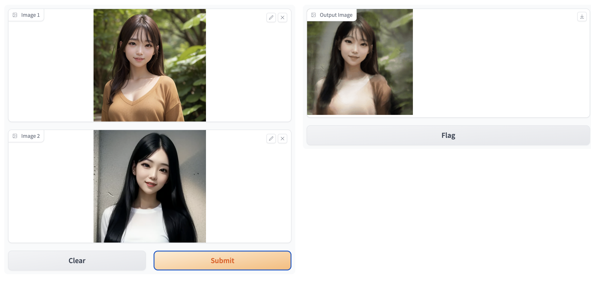

# 2img-to-gif

This Python program produces a GIF that seamlessly transforms from the first to the second image when two different images are passed.

## Demo

### Input images

<div style="display: flex; justify-content: space-around;">
  
  
</div>

### Output gif


## Usage

First you need to install [RIFE ncnn Vulkan](https://github.com/nihui/rife-ncnn-vulkan) in your environment.  
Release binaries for each OS are available in [GitHub releases](https://github.com/nihui/rife-ncnn-vulkan/releases), so please download them.

Next, put the path to RIFE ncnn Vulkan in your `.env` file.

Copy the `.env_sample` with the name `.env`.
Then specify the path.

```
cp .env_sample .env
```

Example setting `.env`:

```
RIFE_NCNN_VULKAN_PATH =./rife-ncnn-vulkan/rife-ncnn-vulkan
```

Then install the Python dependencies.  
This project uses [rye](https://github.com/mitsuhiko/rye).

```
rye sync
```

Finally, run the following command to launch Gradio's Web UI.

```
python launch.py
```

Access to `localhost:7860`.



## Google Colab

**Now it still doesn't work correctly.**

To use on Google Colab, execute the following command

```
!apt-get install -y libvulkan-dev

!git clone https://github.com/shinshin86/2img-to-gif.git
%cd 2img-to-gif

!wget https://github.com/nihui/rife-ncnn-vulkan/releases/download/20221029/rife-ncnn-vulkan-20221029-ubuntu.zip
!unzip rife-ncnn-vulkan-20221029-ubuntu

!echo "RIFE_NCNN_VULKAN_PATH =./rife-ncnn-vulkan-20221029-ubuntu/rife-ncnn-vulkan" > .env

!pip install gradio python-dotenv

!python launch.py --share
```

## Special thanks

I came up with this program after learning about [RIFE ncnn Vulkan](https://github.com/nihui/rife-ncnn-vulkan).